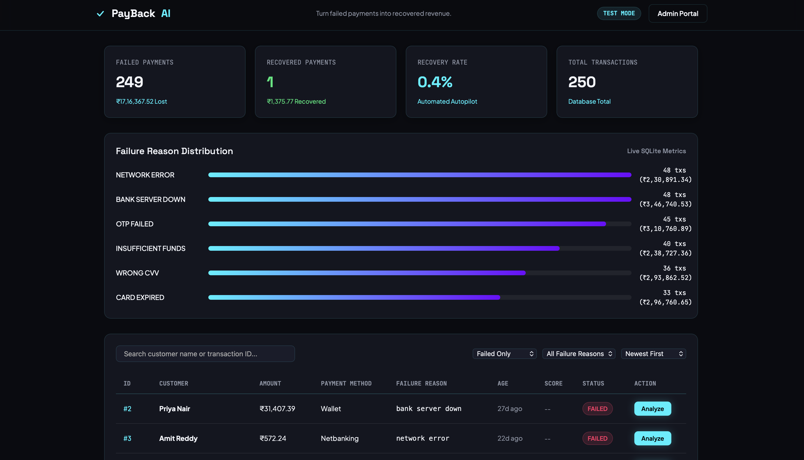
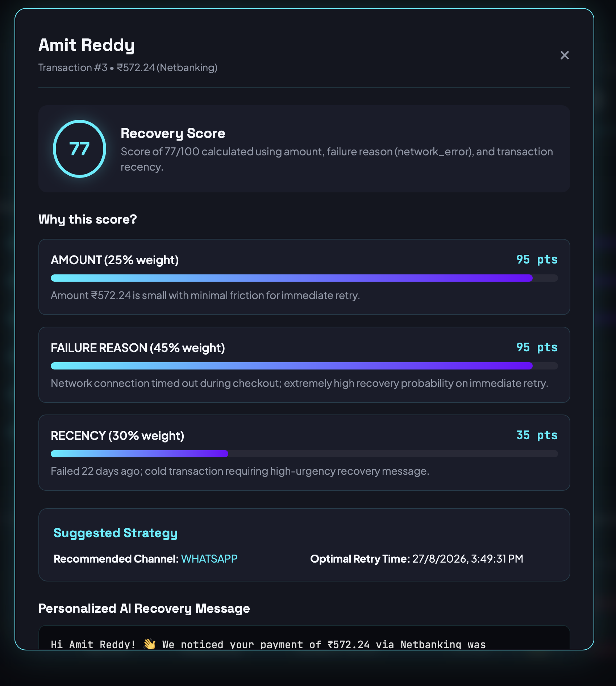
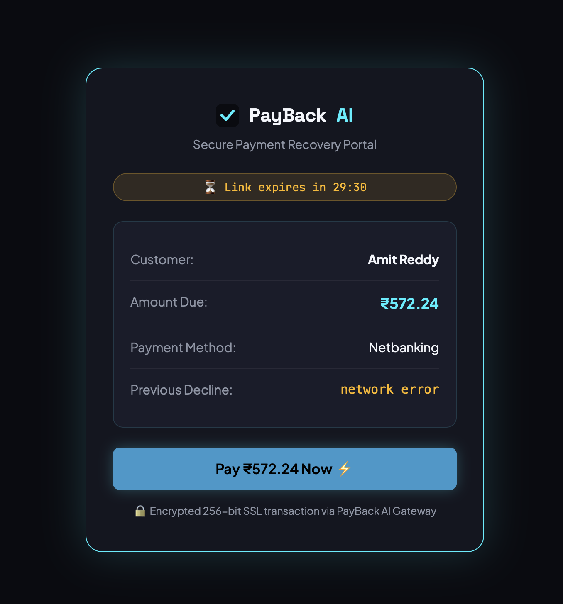
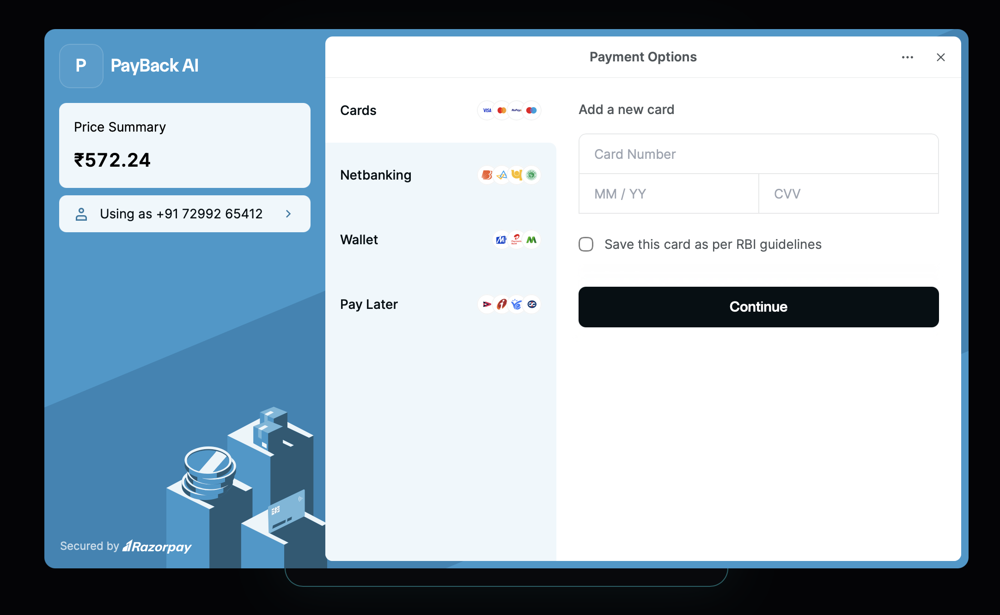
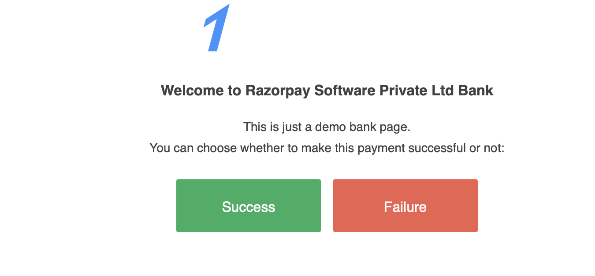
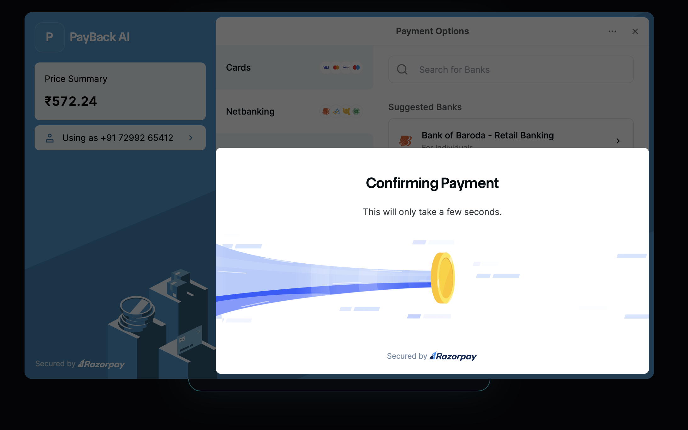
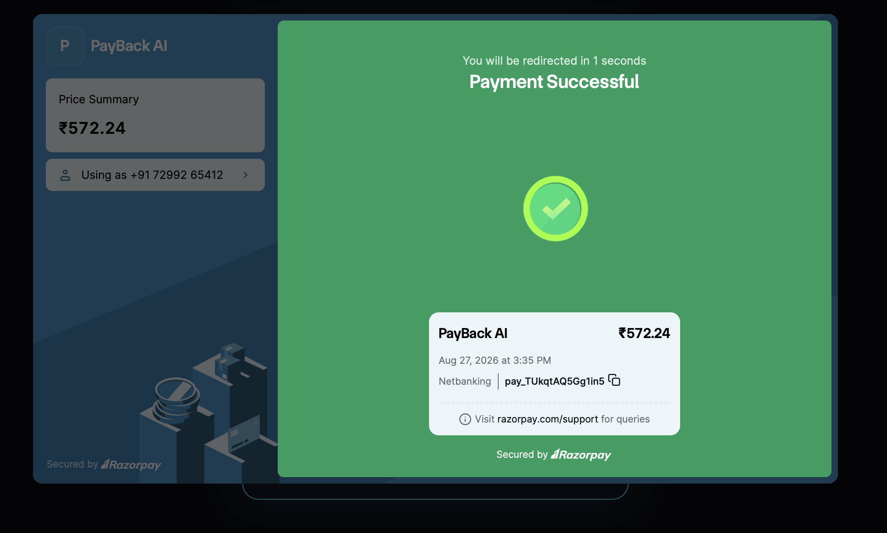
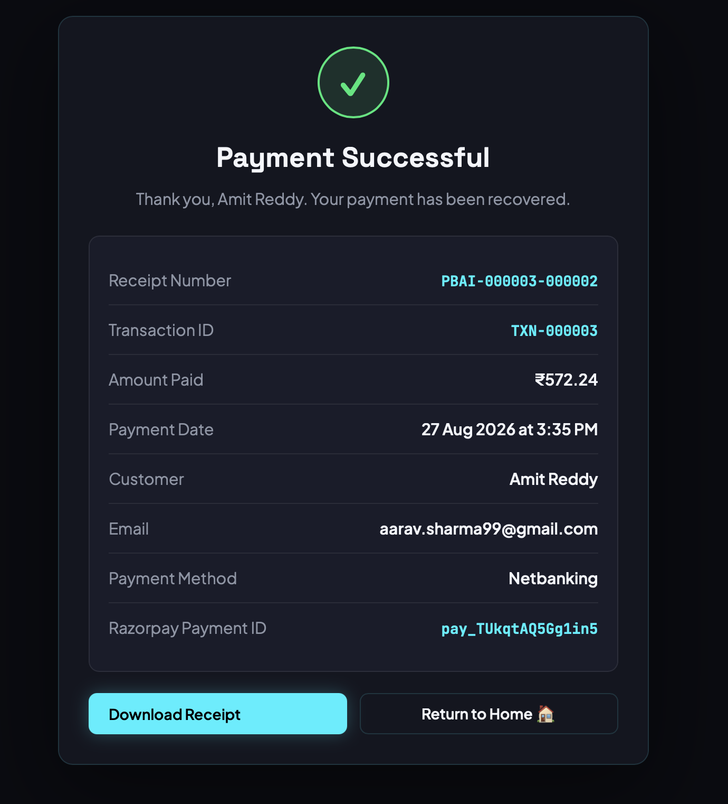
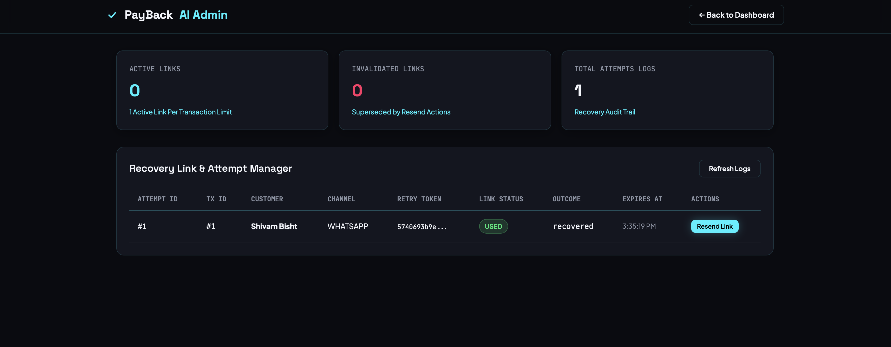

# PayBack AI — Intelligent Revenue Recovery Agent

> **Turn failed payments into recovered revenue.**

Built for the **Razorpay AI Builder Internship 2026 — Track 3: AI Revenue Recovery**.

PayBack AI is an intelligent revenue recovery platform designed for SaaS businesses, fintech platforms, and subscription services. It automatically analyzes failed payment transactions, calculates a transparent recovery score, generates personalized AI recovery messages via Gemini, issues secure 1-click retry links, and processes payment recoveries.
 
---

## 💡 Problem Statement

Every day, a significant share of digital payments fail — not because customers changed their mind, but due to network drops, expired cards, wrong OTPs, insufficient funds, or temporary bank server issues. In most cases, **no money is deducted, but the sale is simply lost** — and most platforms only send a generic, easy-to-ignore "please retry" notification, so this revenue never comes back.

PayBack AI solves this by automatically figuring out **which** failed transactions are worth pursuing, **when** and **how** (channel + timing) to reach out, and generating a **personalized** recovery message — then giving the customer a secure, one-click way to complete their payment.

---

## 🏗️ Architecture Overview

```text
                  ┌────────────────────────────────────────┐
                  │   Client Applications & Portals        │
                  │  (Dashboard / Retry Page / Admin)     │
                  └──────────────────┬─────────────────────┘
                                     │ HTTP / REST API
                                     ▼
                  ┌────────────────────────────────────────┐
                  │        Express API Server              │
                  │   (routes/transactions, recovery,     │
                  │    retry, admin, webhook)              │
                  └──────────────────┬─────────────────────┘
                                     │
         ┌───────────────────────────┼───────────────────────────┐
         │                           │                           │
         ▼                           ▼                           ▼
┌──────────────────┐       ┌──────────────────┐       ┌──────────────────┐
│ Recovery Engine  │       │ Gemini AI Agent  │       │ Notifier & RZP   │
│ (classifier.js)  │       │  (aiAgent.js)    │       │ (notifier/rzp)   │
└────────┬─────────┘       └────────┬─────────┘       └────────┬─────────┘
         │                          │                          │
         └──────────────────────────┼──────────────────────────┘
                                    │
                                    ▼
                       ┌──────────────────────────┐
                       │  SQLite Database Core    │
                       │ (./data/transactions.db) │
                       └──────────────────────────┘
```

---

## ⚡ Key Features

- **Transparent Rule-Based Scoring Engine:** Calculates a 0–100 recovery score based on amount, failure reason, and transaction recency.
- **Explainable Scoring Breakdown:** Every score provides a detailed mathematical breakdown showing factors, weights, points, and dynamic contextual explanations — never a black box.
- **Gemini AI Personalized Recovery Messages:** Generates channel-tailored recovery copy (SMS, WhatsApp, Email) using Google's Gemini API with pre-formatted fallback protection if the API is unavailable.
- **Strict 1-Click Link Security & Invalidation:** Every retry token is cryptographically generated and time-limited. Issuing a new link automatically invalidates any previous active link for that transaction.
- **Interactive Retry & Payment Recovery Portal:** Customers complete payment via a dedicated mobile-friendly checkout portal with a live countdown timer.
- **Admin Management Portal:** Password-protected admin dashboard with a full recovery-attempt audit trail, plus the ability to resend or force-expire any link.
- **Razorpay Test Mode Integration:** Real Razorpay order creation and HMAC-SHA256 signature verification, with a seamless fallback to an internal demo checkout when credentials aren't configured.

---

## 🛠️ Technology Stack

- **Backend:** Node.js, Express.js (CommonJS)
- **Database:** SQLite via `better-sqlite3` (`./data/transactions.db`)
- **AI Engine:** Google Gemini API (`@google/generative-ai`)
- **Payment Gateway:** Razorpay Node.js SDK (Test Mode)
- **Notifications:** Nodemailer (SMTP with console-log fallback)
- **Frontend:** Plain HTML5, Modern CSS3, Vanilla JavaScript

---

## 🚀 Quick Start Guide

### 1. Installation
Clone the repository and install dependencies:
```bash
git clone https://github.com/shivambisht00/PaybackAI.git
cd PaybackAI
npm install
```

### 2. Environment Configuration
Copy `.env.example` to `.env` and adjust settings as needed:
```bash
cp .env.example .env
```

`.env` configuration sample:
```env
PORT=3000
LINK_EXPIRY_MINUTES=30
ADMIN_PASSWORD=admin123

# Gemini API Key (Optional - uses fallback copy if empty)
GEMINI_API_KEY=your_gemini_api_key_here

# SMTP Email Configuration (Optional - uses console mock if empty)
SMTP_HOST=smtp.gmail.com
SMTP_PORT=587
SMTP_USER=your_email@gmail.com
SMTP_PASS=your_app_password
EMAIL_FROM=PayBack AI <noreply@payback.ai>

# Razorpay Test Mode (Optional - uses internal retry flow if empty)
RAZORPAY_KEY_ID=
RAZORPAY_KEY_SECRET=
RAZORPAY_WEBHOOK_SECRET=
```

> ⚠️ `ADMIN_PASSWORD=admin123` above is a **demo default only**. Change this to a strong password before any real deployment, and never commit a real `.env` file to version control.

### 3. Seed Database
Generate 250 realistic failed transactions across Indian customer profiles:
```bash
npm run seed
```

### 4. Run Server
Start the development server:
```bash
npm run dev
# or
npm start
```

Access the application in your browser:
- **Main Dashboard:** `http://localhost:3000`
- **Admin Portal:** `http://localhost:3000/admin.html` (Password: `admin123`)

---

## 📊 End-to-End Recovery Flow

```text
Failed Payment Transaction in DB
       ↓
Click "Analyze" on Main Dashboard
       ↓
Scoring Engine calculates Score & Explainable Breakdown
       ↓
Gemini AI generates channel-specific Recovery Message
       ↓
Secure 1-Click Retry Token & Expiry (30 mins) issued
(Any previous active link for this transaction becomes INVALIDATED)
       ↓
Notification sent via Nodemailer / Console Log
       ↓
Customer opens Retry Link (http://localhost:3000/retry.html?token=...)
       ↓
Customer clicks "Pay Now"
       ↓
Payment succeeds → Transaction status updated to RECOVERED
       ↓
Retry Link status becomes USED (preventing re-use)
```

---

## 📸 Screenshots

### 1. Main Dashboard
Live stats (failed/recovered/recovery rate), failure-reason distribution, and the transaction table.



### 2. Recovery Analysis (Explainable Scoring)
Clicking "Analyze" shows the transparent score breakdown, suggested strategy, and the Gemini-generated personalized recovery message.



### 3. Secure Retry Portal
The customer-facing recovery link — shows amount due, previous decline reason, and a live expiry countdown.



### 4. Razorpay Checkout — Payment Options
Real Razorpay Test Mode checkout, prefilled with the recovery amount.



### 5. Razorpay Test Bank Page
Razorpay's built-in test-mode bank simulator, used to simulate a successful (or failed) payment in Test Mode.



### 6. Payment Confirmation In Progress
Razorpay confirming the payment before returning control to PayBack AI.



### 7. Razorpay Success Screen
Razorpay's own success confirmation before redirecting back.



### 8. Receipt Page
Final receipt generated by PayBack AI after signature verification — includes the Razorpay payment ID and a downloadable receipt.



### 9. Admin Portal
Password-protected audit trail of every recovery attempt, with link status and resend/expire controls.



---

## ⚠️ Known Limitations

- Runs on **Razorpay Test Mode** — no real money is processed.
- Email notifications require SMTP credentials in `.env`; without them, notifications fall back to console logging (visible in server logs) rather than an actual inbox.
- Gemini AI message generation requires a valid `GEMINI_API_KEY`; without one, a pre-written fallback message is used instead.
- This is a working prototype built for evaluation purposes, not a production-hardened system.

---

## 🔮 Future Scope

- **Multi-Touch Recovery Sequences:** Automated multi-stage drip reminders (Day 1 SMS, Day 3 WhatsApp, Day 7 Call).
- **Regional Language Localization:** Gemini AI generation in Hindi, Tamil, Telugu, and Kannada.
- **Machine Learning Calibration:** Continuous weighting updates based on historical recovery outcomes.

---

## 📄 License
MIT License. Built for educational and commercial revenue optimization.
